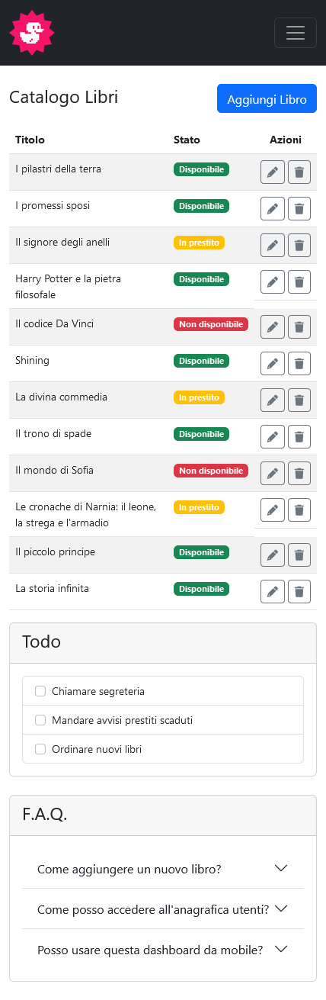
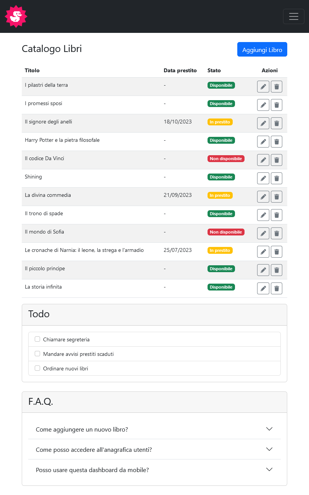
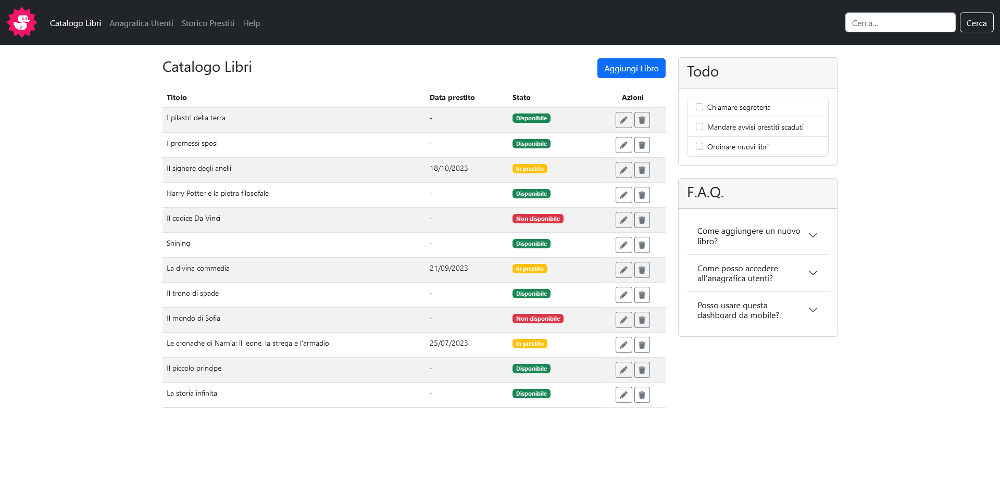

# 📚 Catalogo Libri 📖 
**Catalogo Libri** è una dashboard responsiva per la gestione di un archivio di libri, sviluppata con **HTML**, **Bootstrap 5** e **JavaScript**. Il progetto offre un'interfaccia moderna e intuitiva, perfettamente adattabile a dispositivi desktop, tablet e mobile. 
---
## 🚀 Funzionalità principali 
✅ **Gestione libri**: Visualizza lo stato dei libri (disponibile, in prestito, non disponibile). 
✅  **Azioni rapide**: Modifica o elimina un libro con un solo click. 
✅  **Todo list**: Un pratico elenco di attività per la gestione della biblioteca. 
✅  **F.A.Q. interattiva**: Sezione con risposte a domande frequenti, con effetto a fisarmonica. 
✅  **Navbar dinamica**: Menu a panino animato su dispositivi mobili. 
✅  **Design responsivo**: Layout ottimizzato per desktop, tablet e smartphone. 
---
## 🛠 Tecnologie utilizzate 
**HTML5** 🏗
**Bootstrap 5** 🎨
**JavaScript (Bootstrap Bundle)** ⚡️
---
## 📸 Anteprima 
### 📱 **Versione Mobile** 

### 📱 **Versione Tablet** 

### 🖥 **Versione Desktop** 

---
## 📦 Installazione 
1️⃣ **Clona il repository** 
```bash
git clone https://github.com/tuo-utente/catalogo-libri.git
```
2️⃣ **Apri il file `index.html`** direttamente nel browser. 
